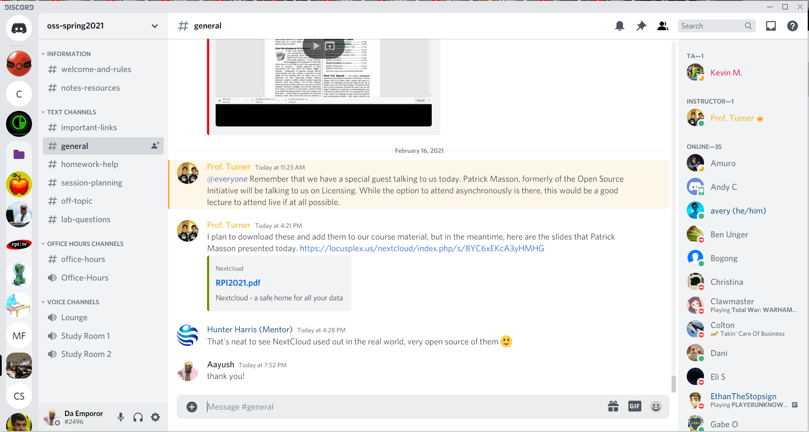
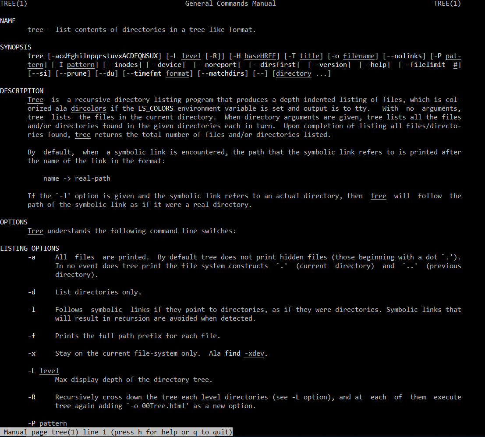
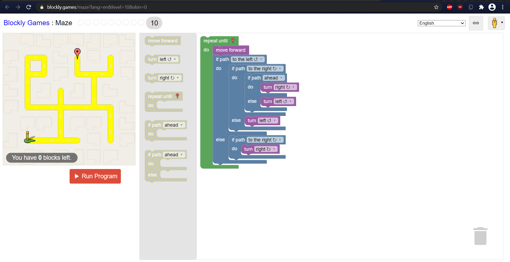
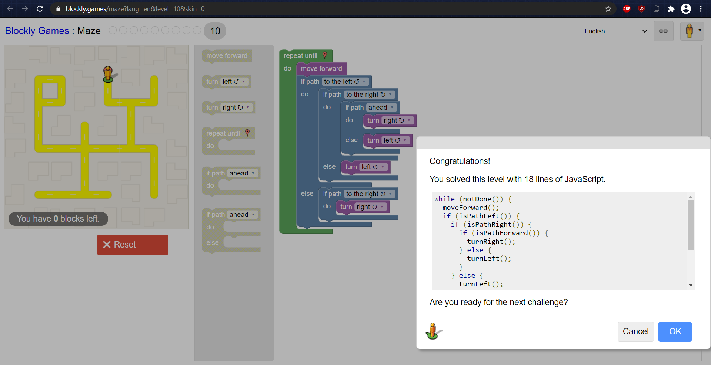

# Lab 01 Report - Introduction to Open Source Software

## 0. Discord

## 1. Github Account
I have created one. It is here.

## 2. Reading Assignments
Essentially, Open Source is not just "here's the source code," but rather it is a structure that allows
developers to sort of bounce off of each other and increase compatibility.

Two additional suggestions for "How to answer questions in a helpful way" are:
* If you don't know, try to point them in the right direction.
* Try to get another person to verify the answer you give.

The 3rd chapter of Free Culture was very concerning to me. I found it ridiculous that the RIAA could even make a claim like that in the first place without being laughed off by the courts, but since it held up, it unsurprisingly came down to "you may be able to win this case, but at what cost?" The tactics used by the RIAA in this case remind me of SLAPP lawsuits, which abused the expensiveness of legal cases to shut down opposition from individuals. However, until the copyright system gets suitably revised, this chapter reminded me to be careful when handling large amounts of data coming from multiple sources and to be careful when creating open source software, as you never know what exactly could cause a company to try to turn you into a scapegoat (if you do, you either are or should be a lawyer).

## 3. Linux

## 4. Regex
Problems:
[p1](regex/prob1.PNG)
[p2](regex/prob2.PNG)
[p3](regex/prob1.PNG)
[p4](regex/prob4.PNG)
[p5](regex/prob5.PNG)
[p6](regex/prob6.PNG)
[p7](regex/prob7.PNG)

Crosswords:
[c1](regex/cross1.png)
[c2](regex/cross2.png)
[c3](regex/cross3.png)
[c5](regex/cross5.png)

## 5. Blockly

## 6. Reflection
An interesting open source project that would interest me would be an emulator for the nintendo DS that supports WiFi capabilities.
Currently, there is no DS emulator that has full WiFi compatibility with other instances of the emulator on other computers. The most popular emulator, DeSmuME, does not support WiFi and will not receive support in the forseeable future, while the only emulator that I know of that does support it, MelonDS, does not perform said functions particularly well. This would be a interesting problem to tackle, since emulators of more recent systems like Citra's 3DS emulator do have support, yet this one is curiously difficult to get working. Significant progress into this field could also give insight on how to better preserve the full experience of older systems (not just videogames!). However, I am not sure whether I want to commit to this particular project yet, as I may come across a much more interesting project within the coming week(s).
