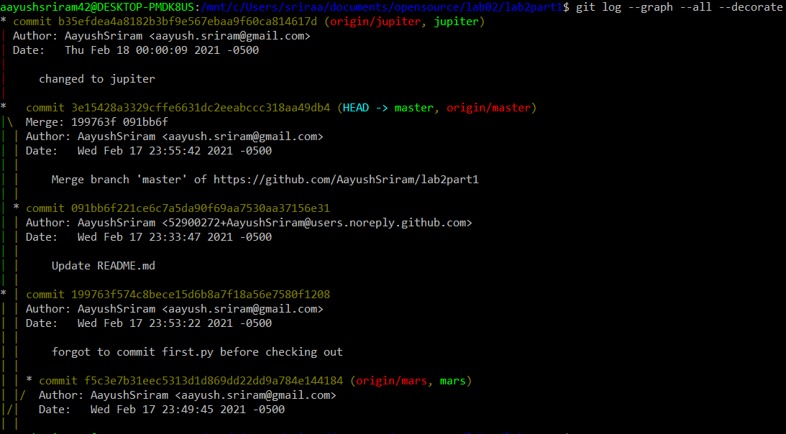
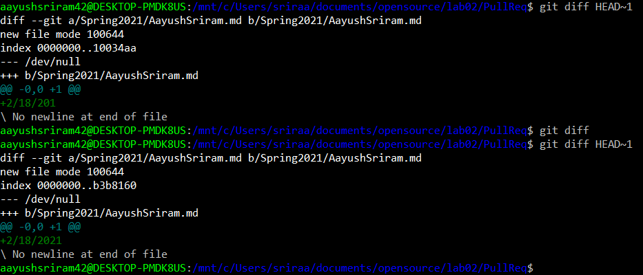
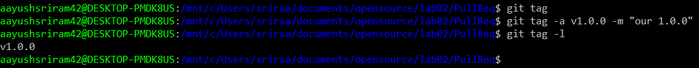

# Lab 2: Learning Git
## Part 1
[Link to lab2part1](https://github.com/AayushSriram/lab2part1) 
I couldn't get gitk to work properly \(something about it requiring Tk and no $DISPLAY env. variable\), but git log is here: 

## Part 2
[Link to fork of SpoonKnife](https://github.com/AayushSriram/Spoon-Knife) 
Learn Git Branching 1-4: 
[level1](gitlvl1.png)
[level2](gitlvl2.png)
[level3](gitlvl3.png)
[level4](gitlvl4.png)

## Part 3
[Link to forked PullReq](https://github.com/AayushSriram/PullReq) 
Git Diff: 
 
Git Tag: 
 
