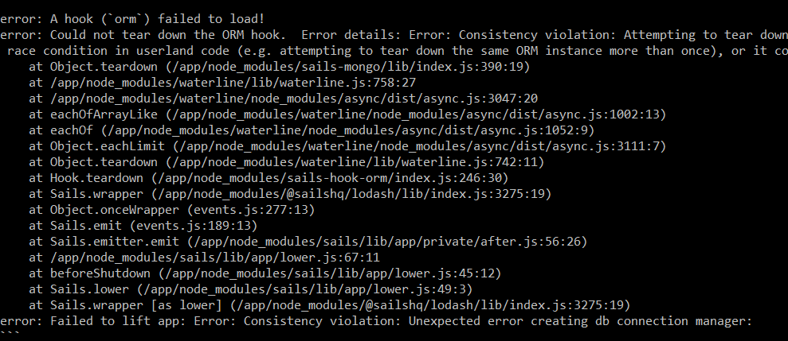

# Example 0:
 
Docker works.
# Example 1:
Installed and messed around with Ubuntu image. 
 
Installed vim, made/moved a file to root directory. 
 
Installed cowsay, it said "bonk". 
 
# Example 2:
Successfully built, ran, listed, and removed the RocketChat container. 
 
# Example 3:
Successfully ran the webserver after building the image from Dockerfile. 
 
# Example 4:
Built the initial image. 
 
Oh no! An error! (Note: the content is somewhat different, but it was likely the same issue) 
Also, removing node_modules from the messagingApp directory was the only way I got it to work (Probably your issue).
 
Built it properly this time using a YAML file. Here are the commands I ran after building it:
 
 
