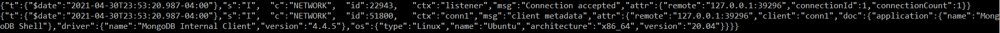
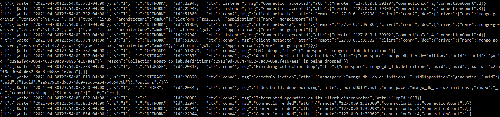
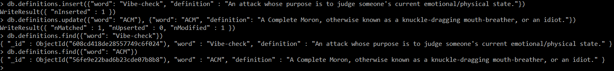

# Checkpoint 1
The output for mongod seems to be in JSON format. No idea how to change that, but here it is. 

# Checkpoint 2
I ran it using the --drop option, which is likely why there is a bunch of extra stuff \(restarted mongod and mongoimport apparently doesn't clear built collections\) 

# Checkpoint 3
I added a definition for "Vibe-check" and updated the definition for "ACM" \(shown below\). 
 
I just saved the output of the git diff to a text file linked [here](check3-diff.txt). I played around a bit to see some functionality of some commands, so it's a bit long. The update is on lines 7/11, and the insert is at the end.
# Checkpoint 4
[Here](checkpoint4.py) is the link to the python script. 
I redirected the output to a separate file \([here](check4_output.txt)\). 
I added some lines to separate each section for easier reading.
# Checkpoint 5
The link to the python script is [here](checkpoint5.py). 
The output is [here](check5_output.txt) 
A lot of my time was taken up trying to configure mongodb to work with WSL. The site linked below helped out a lot: 
https://github.com/michaeltreat/Windows-Subsystem-For-Linux-Setup-Guide/blob/master/readmes/installs/MongoDB.md