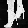

# Checkpoint 1: Verify Tensorflow

# Checkpoint 2: Run a Tensorflow Classification

# Checkpoint 3: Curate Some Data
ankle boots 
 
converted 
 
classification: Trouser 
sneakers 
 
converted 
 
classification: Bag 
Trousers 
 
converted 
 
classification: Trouser
