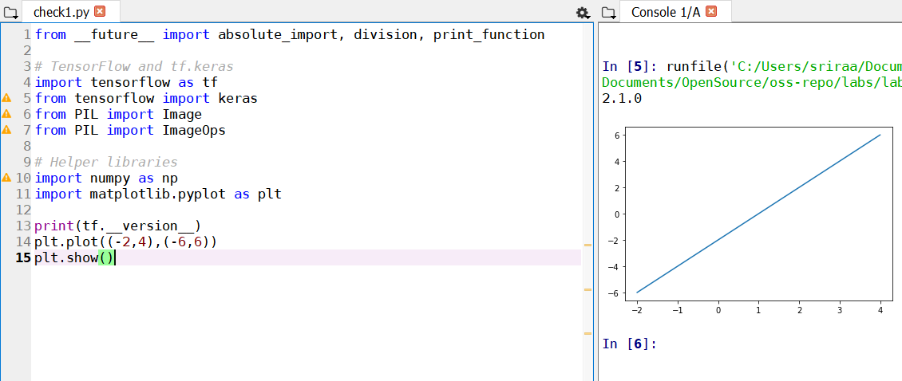

# Checkpoint 1: Verify Tensorflow

# Checkpoint 2: Run a Tensorflow Classification

# Checkpoint 3: Curate Some Data
ankle boots

converted

classification: Trouser 
sneakers

converted

classification: Bag
Trousers

converted

classification: Trouser